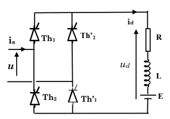
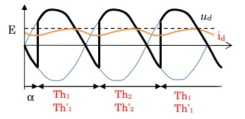
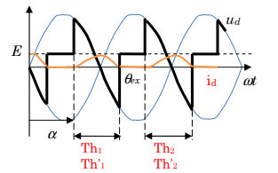
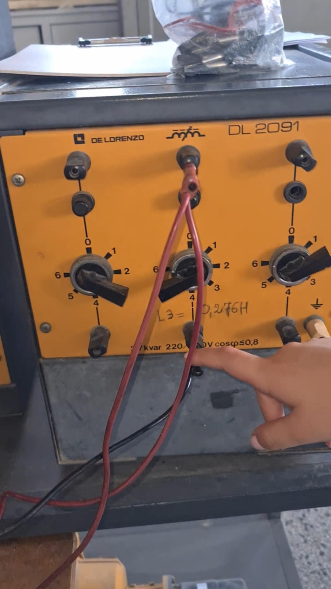
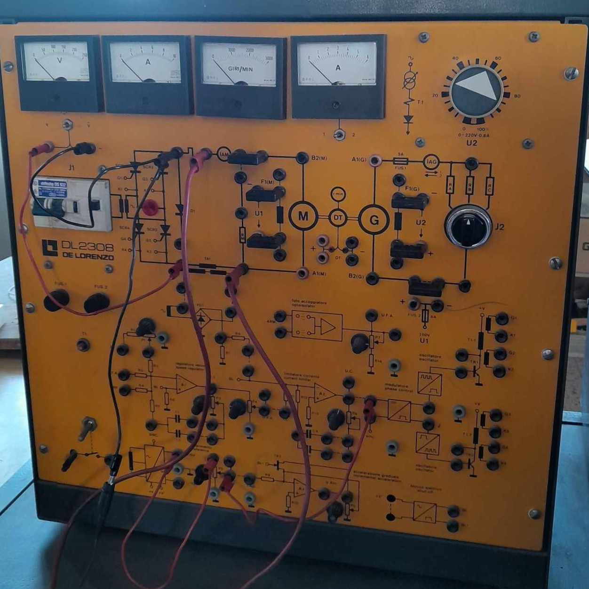
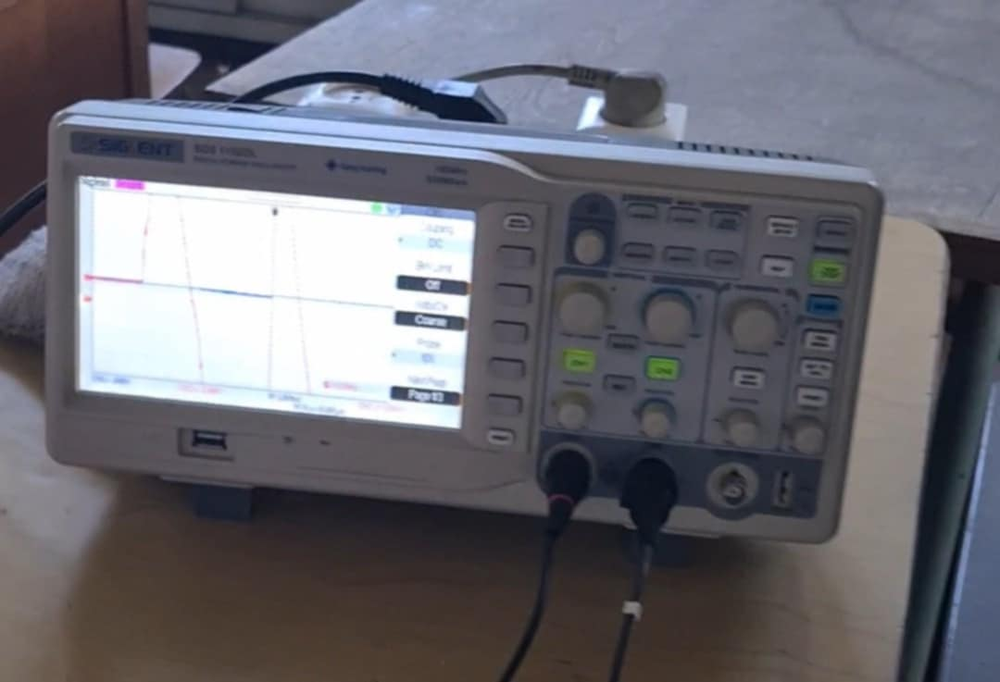
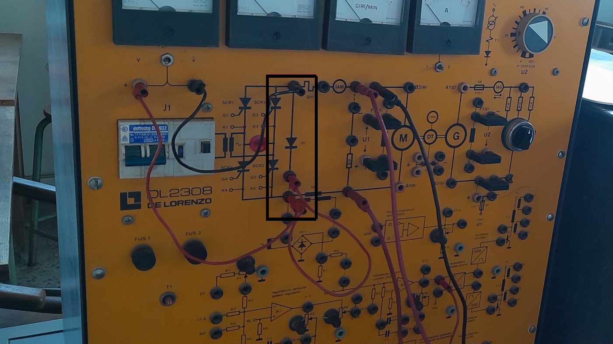
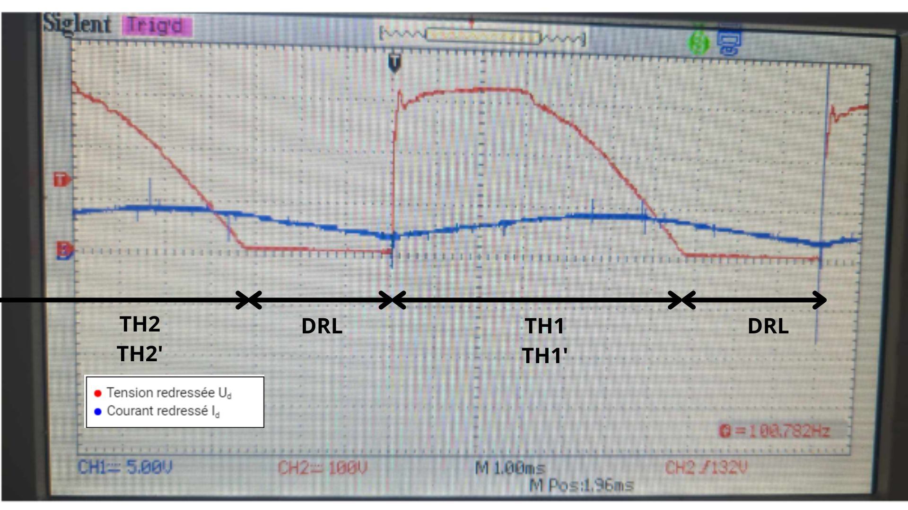

<h3>Project Overview</h3>

  This experiment investigates the behavior of a <strong>DC machine</strong> using
  different rectifier configurations. The study examines the relationship between
  the <strong>firing angle, rectified voltage, current, and machine speed</strong>.
  Experimental results are compared with theoretical models to evaluate the effects
  of rectification and additional components such as a <strong>freewheeling diode</strong>
  and a <strong>smoothing inductor</strong>.

<h3>Objectives</h3>
<ul>
  <li>
    Study the <strong>conduction mode</strong> for an RLE active load and the
    smoothing effect on the rectified current.
  </li>
  <li>
    Analyze the effect of a <strong>freewheeling diode (FWD)</strong> on the
    rectified current and conduction mode.
  </li>
  <li>
    Study the <strong>speed control characteristics</strong> and speed variation
    of the DC machine.
  </li>
</ul>
<h3>Theoretical Background</h3>

  A <strong>single-phase thyristor bridge</strong>, also known as a
  <strong>full-wave thyristor rectifier</strong>, is a power electronic circuit
  used to convert AC voltage into DC voltage. By adjusting the
  <strong>thyristor firing angle</strong>, the portion of the AC waveform being
  rectified can be controlled, thereby regulating the output DC voltage and current.

  

  The <strong>thyristor rectifier</strong> performs a controlled
  <strong>AC-to-DC conversion</strong>. Control is achieved by adjusting the
  <strong>firing delay angle</strong>. The thyristors operate in pairs:
  <strong>(T1 and T1′)</strong> and <strong>(T2 and T2′)</strong>.
  By varying the firing angle, two distinct conduction modes can be obtained:
  <strong>continuous conduction</strong> and <strong>discontinuous conduction</strong>,
  with the other parameters kept fixed.

  For a fixed excitation of the machine field winding, the back electromotive
  force can be expressed as:

  <strong>E = K&phi;&Omega; = h&Omega;</strong>

  The conduction mode depends on the <strong>firing angle</strong>,
  the <strong>back EMF E</strong>, and the parameter:

  <strong>Q = L&omega; / R</strong>

<h3>Operating Mode</h3>

<h4>Continuous Conduction Mode</h4>

  In continuous conduction mode, each pair of thyristors conducts for a duration
  of <strong>&pi;</strong>.

<ul>
  <li>
    For <strong>&omega;t &isin; [&alpha;, &alpha; + &pi;]</strong>:
    <strong>Th1</strong> and <strong>Th1′</strong> are conducting.
     
    <strong>ud = u</strong> and
    <strong>is = id</strong>.
  </li>

  <li>
    For <strong>&omega;t &isin; [&alpha; + &pi;, &alpha; + 2&pi;]</strong>:
    <strong>Th2</strong> and <strong>Th2′</strong> are conducting.
     
    <strong>ud = −u</strong> and
    <strong>is = −id</strong>.
  </li>
</ul>

  

<h4>Average Value of the Rectified Voltage</h4>

  In continuous conduction mode, the average value of the rectified output
  voltage is given by:

  <strong>
    &lt;Ud&gt; =
    (1/&pi;) &int;&alpha;&alpha;+&pi;
    Um sin(&omega;t) d(&omega;t)
  </strong>

  <strong>
    &lt;Ud&gt; =
    (2Um/&pi;) cos(&alpha;)
  </strong>

<h4>Discontinuous Conduction Mode</h4>

  In discontinuous conduction mode, the conduction duration of the thyristors
  is shorter than <strong>&pi;</strong>. The thyristors stop conducting before
  the next pair is triggered.

<ul>
  <li>
    <strong>Th1</strong> and <strong>Th1′</strong> conduct during their
    corresponding conduction interval.
  </li>
</ul>

  

<h4>Average Value of the Rectified Voltage</h4>

  In discontinuous conduction mode, the average value of the rectified voltage
  can be expressed as:

  <strong>
    &lt;Ud&gt; =
    (1/2&pi;)
    &left[
      &int; Um sin(&omega;t) d(&omega;t)
      + &int; E d(&omega;t)
    &right]
  </strong>

  <strong>
    &lt;Ud&gt; =
    Um
    &left[
      cos(&alpha;) - cos(&beta;)
      + K(&beta; - &alpha;)
    &right]
  </strong>

<h3>Experimental Setup</h3>
<table>
  <thead>
    <tr>
      <th>Equipment</th>
      <th>Image</th>
      <th>Description</th>
    </tr>
  </thead>
  <tbody>
    <tr>
      <td><strong>Smoothing Inductor (DL 2091 – De Lorenzo)</strong></td>
      <td>
        
      </td>
      <td>
        Used to smooth the rectified current and reduce current ripple in the
        DC machine circuit.
      </td>
    </tr>
    <tr>
      <td><strong>Distribution Box (DL 2308 – De Lorenzo)</strong></td>
      <td>
        
      </td>
      <td>
        Used to provide electrical connections between the different components
        of the experimental setup and facilitate circuit configuration.
      </td>
    </tr>
    <tr>
      <td><strong>Oscilloscope</strong></td>
      <td>
        
      </td>
      <td>
        Used to observe and analyze the voltage and current waveforms during
        the experiment, particularly the rectification and commutation effects.
      </td>
    </tr>
  </tbody>
</table>
<h3>Continuous and Discontinuous Conduction Modes</h3>

<h4>Continuous Conduction Mode</h4>

  As the <strong>firing angle &alpha;</strong> increases, the average rectified
  voltage <strong>Ud</strong> decreases because the thyristors conduct
  for a shorter portion of the input waveform.

  Consequently, the average current <strong>Id</strong> also decreases,
  leading to a reduction in the <strong>machine speed &Omega;</strong>.

  

<h4>Discontinuous Conduction Mode</h4>

  

<h3>Freewheeling Diode Rectifier with DC Machine</h3>

  A <strong>freewheeling diode</strong> is connected in parallel with an inductive
  load to provide a safe path for the stored inductive energy when the main
  switch or thyristor stops conducting. It prevents dangerous voltage spikes
  and ensures smoother current flow.

  In <strong>DC motor control</strong>, the diode protects the switching devices
  and improves the continuity and stability of the motor current.

  

  

<h3>Conclusions</h3>

<ul>
  <li>
    <strong>Influence of the firing angle &alpha;:</strong>
    The firing angle directly affects the power supplied to the DC machine.
  </li>
  <li>
    <strong>Current continuity and overvoltage protection:</strong>
    Without a freewheeling diode, current interruption during commutation can
    generate dangerous transient overvoltages. The diode protects the circuit
    and maintains continuous current flow.
  </li>
  <li>
    <strong>Inverter operation:</strong>
    A rectifier with a freewheeling diode cannot operate as a
    <strong>line-commutated inverter</strong>, since the current can only flow
    in one direction and energy cannot be returned from the load to the AC source.
  </li>
</ul>
